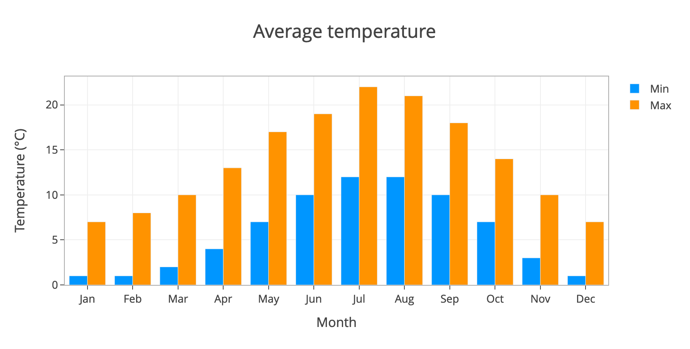
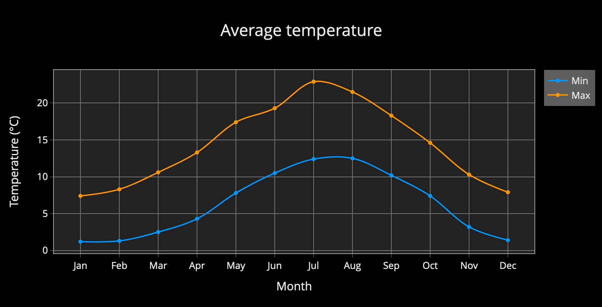
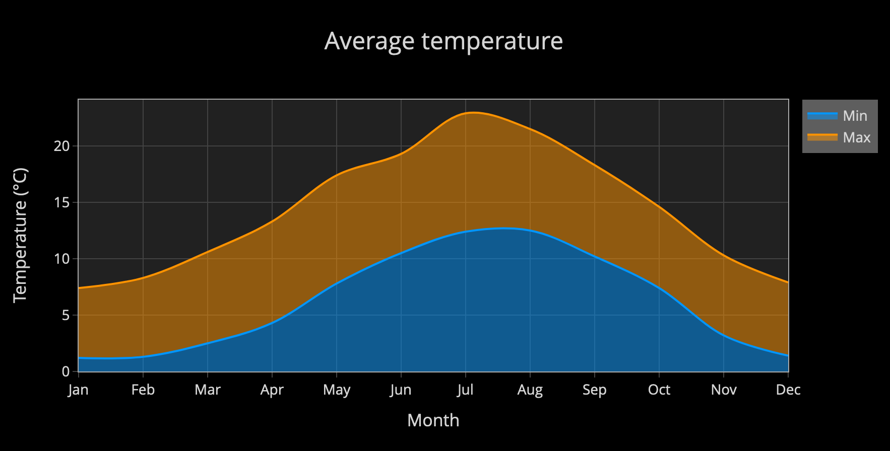

# Bar and Line plots

The data for each plot has to be entered in the table in a specific way, so it can be interpreted correctly. The column and row headers for the `Plot data` table have labels to help with this. For example, to create a plot that tracked the rainfall each month for a range of years, the table might look something like the following:

|          | X       | Y0     | Y1     | Y2     | ...Yn  |
|----------|:-------:|:------:|:------:|:------:|:------:|
| **Name** | `Month` | `2018` | `2019` | `2020` |        |
| **D0**   | Jan     | 3      | 1      | 2.3    |        |
| **D1**   | Feb     | 4.3    | 2.2    | 2      |        |
| **D2**   | Mar     | 5      | 7.9    | 6      |        |
| **D3**   | Apr     | 7      | 8      | 7.2    |        |
| **...**  |         |        |        |        |        |
| **Dn**   |         |        |        |        |        |

With `line` and `bar` plots, the first X column is common. In this instance, D0 to D3 holds the month name. The first row of the table is special in that it holds the names of the data columns. These are used to label the plot traces and legends.

## Line plot

## Bar chart

## Line plot with modified layout

## Filled line plot with modified layout

