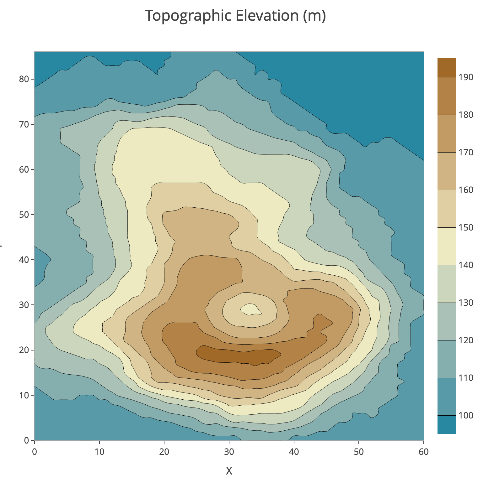
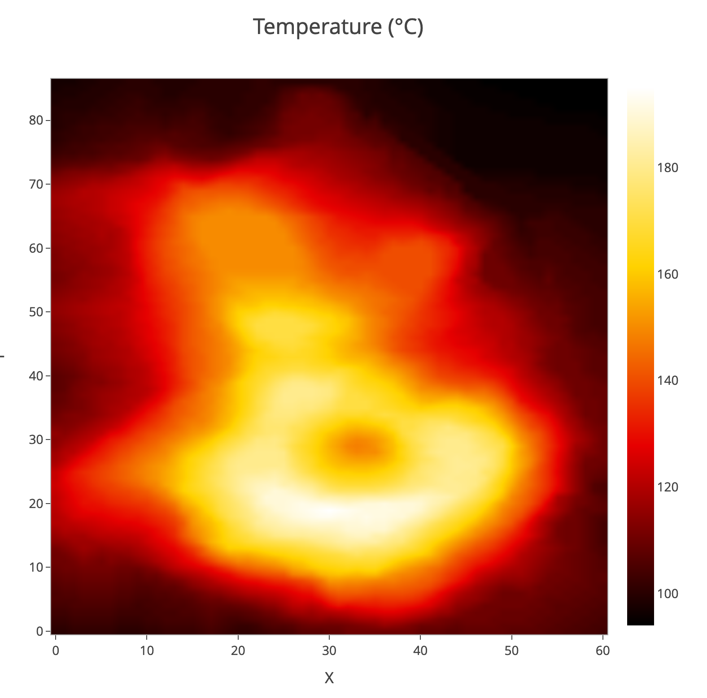

# Contour and Heatmap plot

A contour and heatmap `Plot data` is structured as a 2D grid with the call values representing the 'z' value. The axes can be labeled numerically or with text labels.

|          |            | X0     | X1     | X2     | ...Xn  |
|----------|:----------:|:------:|:------:|:------:|:------:|
|          | `Axis y/x` | `10`   | `20`   | `30`   |        |
| **Y0**   | `A`        | 3      | 1      | 2.3    |        |
| **Y1**   | `B`        | 4.3    | 2.2    | 2      |        |
| **Y2**   | `C`        | 5      | 7.9    | 6      |        |
| **Y3**   | `D`        | 7      | 8      | 7.2    |        |
| **...**  |            |        |        |        |        |
| **Yn**   |            |        |        |        |        |

## Contour plot

## Heatmap plot

